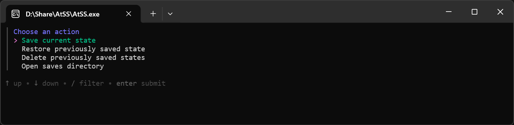
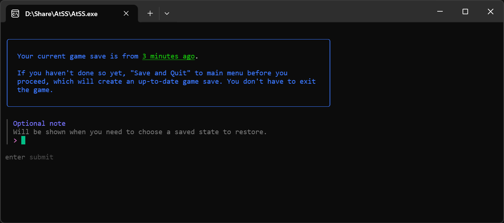
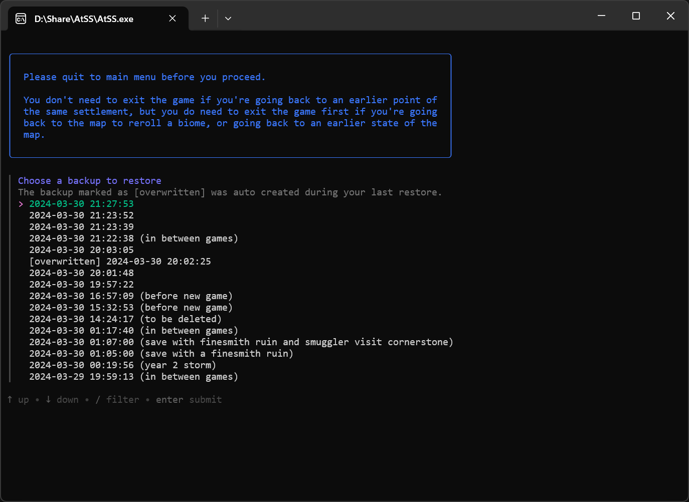

# AtSS — Against the Storm Save Scummer

A small utility to streamline save scumming for [Against the Storm](https://store.steampowered.com/app/1336490/Against_the_Storm/), which officially doesn't support that.

- [Download](https://github.com/fanaticscripter/AtSS/releases)
- [Screenshots](#screenshots)

## What's supported

- Tested to work with the Steam version of the game on Windows.

- Back up your game save at any point, with an optional note (similar to save titles in other games).

- Restore backed up saves at any point. An auto backup of the save to be overwritten is created before each restore.

- Delete backed up saves.

- Open the saves directory (typically `%USERPROFILE%\AppData\LocalLow\Eremite Games`) for manual operations. The game saves are in a folder there called `Against the Storm`, whereas our backups are saved in a separate folder called `Against the Storm - AtSS Backups` so that they aren't synced to Steam Cloud.

- If you're used to the command line, you can use subcommands to skip the main menu. See `AtSS --help`.

## What's not supported

- Non-Steam and/or non-Windows versions of the game.

- Multiple profiles or Queen's Hand Trials. I've been playing exclusively with the main profile, and I haven't bothered to try Queen's Hand Trials (might be a bit too tedious for my taste if they are more difficult than P20).

- No tech support. You can tell me about issues, but I don't promise to respond or solve your problems. I'm just sharing something I wrote for myself, and it already works well enough for me.

## Recommendations

- You're encouraged to install [Windows Terminal](https://aka.ms/terminal) and [set it as your default terminal application](https://learn.microsoft.com/en-us/windows/terminal/customize-settings/startup#default-terminal-application). I'm not sure the legacy console handles colors correctly.

## Screenshots

The main menu:

Example of the save dialog:

Example of the restore dialog:

## Contribution

Code contributions NOT welcome. You ARE welcome to do whatever the hell you want with the code to suit your needs.

If you really enjoyed this stuff, you may take a look at [my Patreon](https://patreon.com/mk2production):

(I'd be grateful if you donate. It's not a tech support subscription though.)
